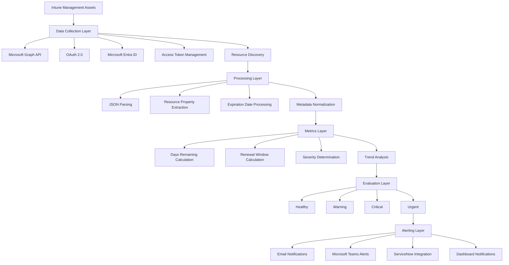

# Intune-Expiry-Monitoring-Platform

# Microsoft Intune Certificate & Token Expiry Monitoring Platform

> A Microsoft Graph-powered monitoring platform for proactively detecting expiry risks across critical Microsoft Intune management assets.


---

## Overview

The **Microsoft Intune Certificate & Token Expiry Monitoring Platform** is a Microsoft Graph-based monitoring solution designed to proactively monitor critical Microsoft Intune management assets and identify upcoming expiration risks.

The platform combines:

* Microsoft Intune
* Microsoft Graph API
* Microsoft Entra ID
* OAuth 2.0
* Client Credentials authentication
* Application permissions
* Resource discovery
* JSON processing
* Metric generation
* Threshold-based evaluation
* Alerting architecture
* SRE-inspired monitoring concepts

The primary goal is to provide **early visibility into certificate and token expiration** before those expirations can affect device management operations.

The project currently focuses on the investigation and monitoring of **APNs certificates**, while the architecture is designed to support additional Intune management assets such as enrollment-related tokens, VPP tokens, and DEP/ABM tokens.

---

# Problem Statement

Organizations using Microsoft Intune depend on several certificates, tokens, and service integrations to maintain device-management functionality.

Examples include:

* **APNs Certificates**
* **Enrollment Tokens**
* **VPP Tokens**
* **DEP / ABM Tokens**
* **Apple Management Integrations**

When these critical assets expire without proactive monitoring, organizations can experience operational problems such as:

* Device management disruption
* Policy deployment failures
* Loss of communication channels
* Operational incidents
* Security and compliance risks

The challenge is therefore not simply detecting that an asset has expired.

The real operational requirement is:

> **Identify the expiry risk early enough to allow administrators to take corrective action before the dependency becomes unavailable.**

This project addresses that requirement through **automated Graph-based resource discovery, expiry metric generation, threshold evaluation, and alerting**.

---

# Project Objectives

The platform is designed to achieve the following objectives:

### 1. Discover Intune management resources

Use Microsoft Graph APIs to retrieve relevant Intune management resources and their metadata.

### 2. Authenticate securely

Use Microsoft Entra ID and OAuth 2.0 to establish secure application-to-application communication with Microsoft Graph.

### 3. Extract expiry information

Identify relevant expiration properties from Graph API responses.

### 4. Convert raw data into monitoring metrics

Transform resource metadata into operational metrics such as:

* Expiration Date
* Days Remaining
* Renewal Window
* Severity

### 5. Evaluate expiry risk

Classify resources into health states based on remaining validity.

### 6. Support proactive alerting

Generate alerts based on:

* Severity
* Remaining validity
* Business impact

### 7. Build a scalable monitoring model

Use the monitoring design:

```text
Resource
   ↓
Property
   ↓
Metric
   ↓
Threshold
   ↓
Alert
```

This allows additional Intune resources to be added to the monitoring platform without fundamentally changing the monitoring model.

---

# Current Scope

The current implementation scope focuses on:

### APNs Certificate Investigation

Investigating the Microsoft Intune APNs certificate resource, its Graph representation, relevant properties, and expiry information.

### OAuth Authentication

Implementing application-based authentication using:

* Microsoft Entra ID
* OAuth 2.0
* Client Credentials Flow
* Access Tokens

### Graph Resource Discovery

Investigating and retrieving relevant Microsoft Graph resources associated with Intune management assets.

### Metric Generation

Transforming resource properties into monitoring metrics such as:

```text
Expiration Date
      ↓
Days Remaining
      ↓
Monitoring Metric
```

### Threshold Evaluation

Evaluating generated metrics against predefined expiry thresholds.

---

# Future Scope

The architecture is intended to expand beyond APNs certificates.

Planned future monitoring targets include:

* DEP Tokens
* VPP Tokens
* Additional enrollment-related tokens
* Teams Notifications
* Azure Automation integration

The long-term objective is to evolve the project into a broader **Intune management asset monitoring framework**.

---

# Architecture

The platform is organized into distinct monitoring layers.



---

# Architecture Layers

## 1. Data Collection Layer

The Data Collection Layer is responsible for communicating with Microsoft Graph and retrieving management resource information.

### Responsibilities

* Microsoft Graph API integration
* OAuth 2.0 authentication
* Microsoft Entra ID application identity
* Access token management
* Graph resource discovery

### Purpose

The primary purpose of this layer is to securely retrieve management asset metadata from Microsoft Graph.

Conceptually:

```text
Microsoft Entra ID
        ↓
OAuth 2.0
        ↓
Access Token
        ↓
Microsoft Graph
        ↓
Intune Resource
```

---

# 2. Processing Layer

Raw Graph API responses are not immediately suitable for monitoring.

The Processing Layer transforms those responses into structured monitoring data.

### Responsibilities

* JSON parsing
* Resource property extraction
* Expiration date processing
* Metadata normalization

Conceptually:

```text
Graph API Response
        ↓
JSON Parsing
        ↓
Relevant Resource Properties
        ↓
Expiration Information
        ↓
Normalized Monitoring Data
```

This separation allows the collection logic and monitoring logic to remain independent.

---

# 3. Metrics Layer

The Metrics Layer converts expiration information into operational monitoring metrics.

### Responsibilities

* Days remaining calculation
* Renewal window calculation
* Severity determination
* Trend analysis

A simplified metric flow is:

```text
Expiration Date
       ↓
Days Remaining
       ↓
Monitoring Metric
       ↓
Severity
```

For example:

```text
Expiration Date = Future Date

Current Date
      ↓
Calculate Difference
      ↓
Days Remaining
      ↓
Compare Against Threshold
      ↓
Determine Health State
```

The resulting metric can then be consumed by the Evaluation Layer.

---

# 4. Evaluation Layer

The Evaluation Layer determines the health state of a monitored asset.

The project uses four severity states:

| Days Remaining | Health State |
| -------------: | ------------ |
|      > 90 days | Healthy      |
|     31–90 days | Warning      |
|      8–30 days | Critical     |
|      <= 7 days | Urgent       |

### Health Model

```text
                 Expiry Risk
                     │
          ┌──────────┼──────────┐
          │          │          │
       Healthy     Warning   Critical
          │          │          │
       >90 days   31-90      8-30
                              days
                                │
                              Urgent
                              <=7 days
```

The purpose of threshold evaluation is to turn a raw technical value such as:

```text
daysRemaining = 6
```

into an operational state such as:

```text
Health = URGENT
```

This makes the monitoring result actionable.

---

# 5. Alerting Layer

The Alerting Layer is designed to consume the evaluation result and generate an operational notification.

Potential notification channels include:

* Email
* Microsoft Teams
* ServiceNow
* Dashboard notifications

Alert generation is based on:

* Business impact
* Severity
* Remaining validity period

The conceptual flow is:

```text
Resource
   ↓
Expiration Date
   ↓
Days Remaining
   ↓
Severity
   ↓
Business Impact
   ↓
Alert
```

---

# Monitoring Model

The platform follows a resource-oriented monitoring architecture.

```text
Resource
   ↓
Property
   ↓
Metric
   ↓
Threshold
   ↓
Alert
```

### Resource

A monitored Microsoft Intune asset.

Examples:

```text
APNs Certificate
Enrollment Token
VPP Token
DEP / ABM Token
```

### Property

A relevant property obtained from the Microsoft Graph resource.

For expiration monitoring, the primary focus is the resource's expiration information.

### Metric

A normalized operational value derived from the resource property.

Examples:

```text
Expiration Date
Days Remaining
Renewal Window
```

### Threshold

A predefined boundary used to determine the health state.

Example:

```text
>90 days     → Healthy
31–90 days   → Warning
8–30 days    → Critical
<=7 days     → Urgent
```

### Alert

An operational notification generated when the monitored condition requires attention.

---

# APNs Certificate Monitoring

The initial focus of the project is the **Apple Push Notification Service (APNs) certificate** used within the Intune Apple management ecosystem.

The investigation focuses on understanding:

1. How the resource is represented through Microsoft Graph
2. Which properties expose certificate information
3. How expiration information can be extracted
4. How expiration can be converted into monitoring metrics
5. How the metrics can be evaluated against operational thresholds

The intended flow is:

```text
APNs Certificate
       ↓
Microsoft Graph Resource
       ↓
Certificate Properties
       ↓
Expiration Date
       ↓
Days Remaining
       ↓
Severity
       ↓
Alert
```

---

# Business Impact Analysis

A key part of this project is understanding that certificate expiry is not an isolated technical event.

The project models the dependency chain between the certificate and business operations.

```text
APNs Certificate
        ↓
Apple Push Notification Service
        ↓
Intune Device Communication
        ↓
Managed Apple Devices
        ↓
Policy Delivery
        ↓
Business Operations
```

This dependency chain demonstrates why proactive certificate monitoring is important.

A certificate nearing expiration is therefore treated as an **operational risk**, rather than simply a certificate-management event.

The monitoring system is designed around:

> **Early detection → proactive intervention → reduced operational risk**

---

# Engineering Concepts Applied

## Cloud & Identity

The project applies several modern cloud identity concepts:

* Microsoft Entra ID
* OAuth 2.0
* Client Credentials Flow
* Access Tokens
* JWT Claims
* Application Permissions
* Least Privilege Access Model

---

## Microsoft Graph

The project applies Microsoft Graph concepts including:

* Graph API resource discovery
* Endpoint investigation
* Permission mapping
* JSON data processing
* Resource-oriented architecture

The objective is not simply to call an API.

The investigation process focuses on understanding:

```text
Resource
   ↓
Endpoint
   ↓
Permissions
   ↓
Response
   ↓
Relevant Properties
```

---

# Authentication Architecture

The monitoring platform is designed for application-based authentication.

The conceptual authentication flow is:

```text
Monitoring Application
        │
        │ Client Credentials
        ▼
Microsoft Entra ID
        │
        │ Access Token
        ▼
Microsoft Graph
        │
        │ Authorized API Request
        ▼
Intune Resources
```

This enables the monitoring platform to operate as an application identity rather than depending on an interactive administrator session.

The project also applies the principle of:

### Least Privilege

Only the required Microsoft Graph application permissions should be granted to the monitoring identity.

This reduces unnecessary access and aligns the monitoring solution with cloud security principles.

---

# Monitoring & SRE Concepts

The project applies several SRE-inspired engineering practices.

### Metric-Based Monitoring

Convert technical resource information into measurable operational metrics.

### Threshold Evaluation

Use explicit thresholds to determine the current health state.

### Business Impact Analysis

Understand how a technical dependency can affect the wider service.

### Root Cause Analysis

Trace operational problems back through the dependency chain.

### Dependency Mapping

Model dependencies between:

```text
Certificate
    ↓
Service
    ↓
Device Management
    ↓
Policy Delivery
    ↓
Business Operations
```

### Alert Severity Classification

Classify issues according to operational urgency.

---

# Severity Model

The monitoring platform uses the following severity model:

```text
┌─────────────────────────────────────┐
│          HEALTH STATE               │
├─────────────────────────────────────┤
│ > 90 Days       → HEALTHY           │
│ 31–90 Days      → WARNING           │
│ 8–30 Days       → CRITICAL          │
│ <= 7 Days       → URGENT            │
└─────────────────────────────────────┘
```

The model is designed to provide increasing levels of urgency as the expiration date approaches.

---

# Example Monitoring Scenario

Consider an APNs certificate that has:

```text
Expiration Date:
30 Days From Today
```

The metric engine calculates:

```text
Days Remaining = 30
```

The Evaluation Layer compares the result against the threshold model:

```text
30 Days
   ↓
8–30 Days
   ↓
CRITICAL
```

The operational state becomes:

```text
APNs Certificate
        ↓
30 Days Remaining
        ↓
CRITICAL
        ↓
Requires Administrative Attention
```

As the certificate approaches seven days:

```text
7 Days Remaining
        ↓
URGENT
        ↓
Immediate Action Required
```

This illustrates how the platform turns raw expiry information into an actionable operational signal.

---

# Design Principles

The project is built around several engineering principles.

## Proactive Monitoring

Detect risk before service disruption occurs.

## Resource-Oriented Design

Treat Intune management assets as monitored resources.

## Separation of Concerns

Separate:

```text
Data Collection
        ↓
Processing
        ↓
Metrics
        ↓
Evaluation
        ↓
Alerting
```

## Least Privilege

Use permission-scoped Microsoft Graph access.

## Metric-Based Operations

Convert raw infrastructure information into measurable operational signals.

## Business-Aware Monitoring

Evaluate technical conditions according to their potential operational impact.

## Extensibility

Design the framework so additional Intune resources can be monitored using the same architecture.

---

# Technical Skills Demonstrated

This project demonstrates hands-on application of:

* Microsoft Intune
* Microsoft Entra ID
* Microsoft Graph API
* OAuth 2.0
* Client Credentials Flow
* JSON processing
* PowerShell automation
* Monitoring architecture
* Cloud security principles
* Identity & Access Management
* Operational monitoring
* SRE concepts
* API architecture
* Dependency mapping
* Business impact analysis
* Threshold-based monitoring

---

# Future Architecture

The current APNs monitoring implementation provides the foundation for expanding the platform.

The intended evolution is:

```text
                 Intune Expiry Monitoring Platform
                              │
          ┌───────────────────┼───────────────────┐
          │                   │                   │
        APNs             DEP / ABM              VPP
      Certificate          Tokens              Tokens
          │                   │                   │
          └───────────────────┼───────────────────┘
                              │
                     Common Monitoring
                         Framework
                              │
              ┌───────────────┼───────────────┐
              │               │               │
            Metrics       Thresholds        Alerts
              │               │               │
              └───────────────┼───────────────┘
                              │
                    Notification Channels
                              │
          ┌───────────────────┼───────────────────┐
          │                   │                   │
        Email              Teams              ServiceNow
                              │
                         Azure Automation
```

---

# Future Scope

Planned extensions include:

### DEP Tokens

Extend resource discovery and expiry monitoring to DEP / Apple Business Manager-related tokens.

### VPP Tokens

Monitor expiration of Volume Purchase Program-related tokens.

### Microsoft Teams Notifications

Provide operational alerts through Microsoft Teams.

### Azure Automation

Automate recurring monitoring and execution workflows using Azure Automation.

---

# Project Value

This project brings multiple engineering domains together into a single monitoring workflow:

```text
Microsoft Intune
       +
Microsoft Graph
       +
Entra ID
       +
OAuth 2.0
       +
API Architecture
       +
Security
       +
Monitoring
       +
SRE
       +
Business Impact Analysis
```

Rather than treating Intune administration as a purely management-console activity, the project approaches Intune from an **infrastructure engineering and operational monitoring perspective**.

---

# What This Project Demonstrates

The project demonstrates the ability to:

1. Investigate Microsoft Graph resources
2. Understand API-driven infrastructure management
3. Implement application authentication
4. Work with Microsoft Entra ID identities
5. Process JSON API responses
6. Extract operationally relevant properties
7. Build monitoring metrics
8. Define health thresholds
9. Classify operational severity
10. Understand infrastructure dependencies
11. Evaluate business impact
12. Design proactive alerting
13. Apply least-privilege security principles
14. Design an extensible monitoring architecture

---

# CV / Resume Description

### Version 1

> Designed a Microsoft Graph-based monitoring platform for proactive tracking of Microsoft Intune certificates and token expirations. Implemented resource-driven monitoring architecture using Microsoft Entra ID, OAuth 2.0, and Microsoft Graph APIs. Developed metric-based evaluation logic to calculate expiry risk, severity levels, and renewal windows. Applied least-privilege security principles through Entra ID App Registrations and application permissions. Performed dependency mapping and business impact analysis for Apple device management services integrated with Microsoft Intune.

### Version 2

> Architected and developed a Microsoft Graph-powered monitoring solution for Intune management assets, leveraging OAuth 2.0 authentication, Entra ID application identities, and Graph resource discovery. Built a scalable monitoring framework using Resource → Property → Metric → Threshold → Alert design principles. Designed automated expiry risk detection workflows based on critical operational assets such as APNs certificates and enrollment-related tokens. Integrated cloud security best practices including least privilege access, token-based authentication, and permission-scoped API access. Applied SRE-inspired monitoring techniques including threshold evaluation, severity classification, dependency mapping, and business impact analysis.

---

# Repository Roadmap

The repository is expected to evolve through the following stages:

```text
Phase 1
APNs Certificate Investigation
        ↓
Phase 2
Graph Resource Discovery
        ↓
Phase 3
OAuth / Entra ID Authentication
        ↓
Phase 4
Expiry Property Extraction
        ↓
Phase 5
Metric Generation
        ↓
Phase 6
Threshold Evaluation
        ↓
Phase 7
Alerting
        ↓
Phase 8
Additional Intune Assets
        ↓
Phase 9
Teams / ServiceNow Integration
        ↓
Phase 10
Azure Automation
```

---

# Project Philosophy

The objective of this project is not simply to determine:

> **"Is this certificate expired?"**

The monitoring platform is intended to answer a more useful operational question:

> **"How much time remains, what is the current risk level, what service dependencies are affected, and when should an administrator take action?"**

That shift—from simple expiry checking to **proactive operational monitoring**—is the core engineering concept behind the project.

---

# Conclusion

The **Microsoft Intune Certificate & Token Expiry Monitoring Platform** combines Microsoft Intune, Microsoft Graph, Microsoft Entra ID, OAuth 2.0, monitoring engineering, and SRE principles into a single operational monitoring framework.

The initial focus on APNs certificate expiry provides a practical starting point while establishing an architecture that can later support additional Intune management assets.

The long-term goal is to create a reusable platform capable of providing:

```text
Visibility
   ↓
Metrics
   ↓
Risk Detection
   ↓
Severity
   ↓
Proactive Alerting
   ↓
Reduced Operational Risk
```

---

## Project Status

### Current

* APNs Certificate Investigation
* OAuth Authentication
* Graph Resource Discovery
* Metric Generation
* Threshold Evaluation

### Planned

* DEP Tokens
* VPP Tokens
* Microsoft Teams Notifications
* Azure Automation
* Expanded Intune Asset Monitoring

---

## Author

**Infrastructure Engineering / Microsoft Intune Monitoring Project**

Built around Microsoft Intune, Microsoft Graph, Microsoft Entra ID, cloud identity, monitoring engineering, and SRE principles.
