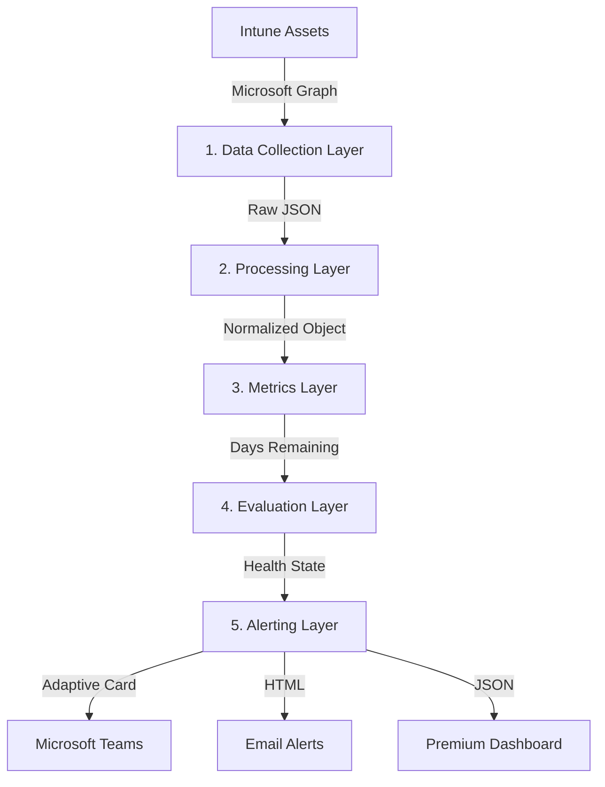

# Intune Expiry Monitoring Platform

> A Microsoft Graph-powered monitoring platform for proactively detecting expiry risks across critical Microsoft Intune management assets.


Organizations using Microsoft Intune depend on certificates, tokens, and service integrations to maintain device-management functionality (e.g., APNs Certificates, Enrollment Tokens, VPP Tokens). When these critical assets expire, organizations experience operational incidents such as device management disruption and policy deployment failures.

The **Intune Expiry Monitoring Platform** solves this by shifting from reactive troubleshooting to proactive operational monitoring. It automatically discovers your Intune management assets, tracks their expiration dates, evaluates their health state against customizable thresholds, and generates rich alerts before expiration affects your business.

---

## ✨ Features

- **Proactive Monitoring**: Track expiration for APNs Certificates, DEP/ABM Tokens, and VPP Tokens.
- **Strict Architecture**: A strict `Resource → Property → Metric → Threshold → Alert` data pipeline.
- **Customizable Thresholds**: Fine-tune renewal windows and health state boundaries (Urgent, Critical, Warning, Healthy).
- **Multi-Channel Alerting**: Native integration for Email, Microsoft Teams (Adaptive Cards), and ServiceNow.
- **Premium Dashboard**: A beautiful, real-time HTML dashboard with glassmorphism styling and dark mode.
- **Automated Validation**: Built-in setup scripts and unit tests to ensure environment readiness.
- **Least-Privilege Security**: Operates using a Microsoft Entra ID App Registration with scoped Application Permissions.

---

## 🏗 Architecture

The platform is designed around 5 distinct monitoring layers, ensuring separation of concerns and easy extensibility.



---

## 🚀 Getting Started

### Prerequisites
- Windows PowerShell 5.1 or later.
- Microsoft Entra ID (Azure AD) administrator access to create an App Registration.
- Microsoft Intune administrator access.

### 1. Configure Microsoft Entra ID
The platform uses OAuth 2.0 Client Credentials flow. You need an App Registration with the correct Graph API permissions.
See the [App Registration Guide](docs/setup/app_registration_guide.md) for step-by-step instructions.

### 2. Configure the Platform
Clone the repository and update the main configuration file:
1. Open `config/monitoring_config.json`.
2. Replace `YOUR_ACTUAL_TENANT_ID`, `YOUR_ACTUAL_CLIENT_ID`, and `YOUR_ACTUAL_CLIENT_SECRET` with your App Registration details.
3. Enable your desired alert channels (`email`, `teams`, `servicenow`) and configure their respective URLs.

### 3. Validate Setup
Run the setup script to validate your environment, check for missing files, and optionally test your Graph API authentication:
```powershell
# Validate the environment structure
.\scripts\Setup-Platform.ps1

# Validate the environment AND test Entra ID authentication
.\scripts\Setup-Platform.ps1 -TestAuth
```

### 4. Run the Monitor
Run the orchestrator to execute a full monitoring cycle. We recommend using `-DryRun` first to prevent sending actual alerts during testing:
```powershell
# Execute a dry run (no alerts sent)
.\src\core\Invoke-MonitoringRun.ps1 -DryRun

# Execute a real production run
.\src\core\Invoke-MonitoringRun.ps1
```

---

## 📊 Dashboard

The platform generates a `monitoring_report.json` artifact at the end of each run. This file powers the local HTML dashboard.

To view the dashboard, simply open `dashboard/index.html` in any modern web browser. The dashboard provides:
- Overall platform health status.
- Summary counts for Urgent, Critical, Warning, and Healthy assets.
- Interactive resource cards with dynamic progress bars.
- A business impact dependency chain diagram.

---

## 📖 Documentation & Runbooks

Operational runbooks are provided for standard incident response procedures:

- **[APNs Certificate Renewal Runbook](docs/runbooks/apns_renewal_runbook.md)**: A step-by-step guide to renewing your APNs certificate when the platform generates a Critical or Urgent alert.
- **[App Registration Setup Guide](docs/setup/app_registration_guide.md)**: Detailed instructions on configuring your Entra ID identity.

---

## 🧪 Testing

The platform includes a suite of unit tests for the core logic engines (Metrics and Evaluation). These tests run offline and require no Microsoft Graph connectivity.

```powershell
# Test the metrics engine date math
.\tests\Test-MetricsEngine.ps1

# Test the threshold evaluation logic
.\tests\Test-ThresholdEvaluation.ps1
```

---

## 📜 License

This project is licensed under the MIT License - see the LICENSE file for details.
